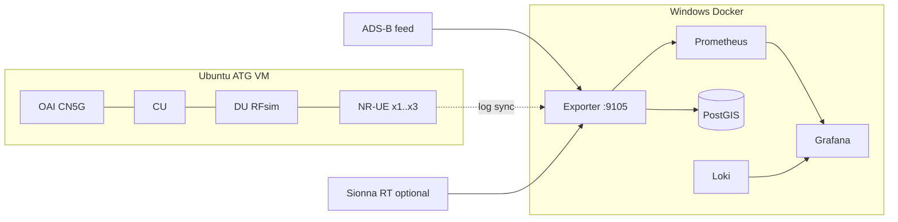

# Architecture

Two-host split: Ubuntu runs the 5G stack; Windows Docker runs observability.



## Data path

```text
ADS-B feed ──► exporter (normalize, integrity, plausibility)
                    │
OAI CU/DU/UE logs ──┼──► OAI ingest (RSRP / SINR / MCS / BLER / HO tokens)
                    │
Sionna RT (opt.) ───┼──► source=sionna gauges when CIR is finite
                    │
                    ▼
         Prometheus  +  PostGIS / GeoJSON
                    │
                    ▼
         Grafana (11 provisioned dashboards)
```

GeoJSON (`http://localhost:9105/geojson/*`) is fetched by the **browser**, so URLs must be reachable from the laptop, not only from the compose network.

Scenario radio defaults (example four-cell LA-basin layout): n78 / 3.5 GHz, 30 kHz SCS, 100 MHz BW, EIRP 46 dBm, channel model `rma_av` (TR 36.777).

## Metric provenance

- `source=oai` — parsed from live or fixture softmodem logs
- `source=sionna` — RT path amplitudes, or modeled A3 candidates tagged as such
- Geometry / TR 36.777 path loss — model output from kinematics; not a softmodem measurement
