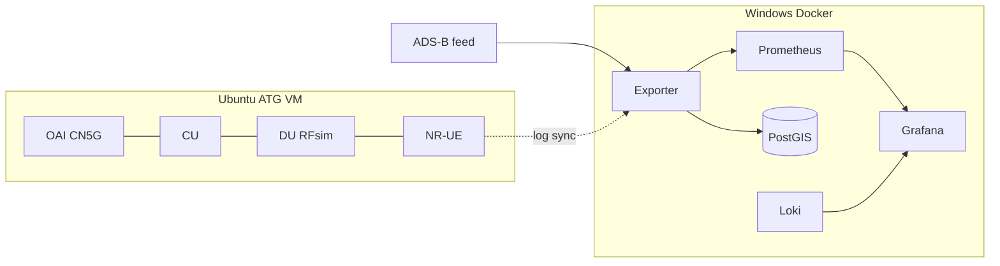

# Lab flow (public)

This page is the end-to-end story of the ATG 5G emulation lab. Implementation
scripts live in a **private** sibling repository. This public folder holds the
architecture, dashboards, reports, screenshots, and sanitized log excerpts.

## Two-host path

1. **RAN / CN (Ubuntu VM)** — OpenAirInterface CN5G + CU/DU/UE in RFsim on band n78. Aircraft UE, ground gNB. No over-the-air RF.
2. **Log sync** — CU/DU/UE/AMF tails are copied to the Windows host (sanitized samples: [`docs/logs-samples/`](docs/logs-samples/README.md)).
3. **ADS-B** — Live or replay kinematics feed the exporter. Metrics and GeoJSON use a pseudonymised `tail_id` only.
4. **Exporter** — Parses OAI logs, scores modeled RF candidates, runs modeled A3, exposes Prometheus metrics and GeoJSON.
5. **Grafana** — Eleven provisioned boards. JSON copies are in [`dashboards/`](dashboards/). Screenshots: [`docs/screenshots/`](docs/screenshots/).

## What is measured vs modeled

| Stream | Label | Meaning |
|--------|--------|---------|
| Softmodem ingest | `source=oai`, `event_origin=oai` | Parsed CU/DU/UE/AMF tokens |
| F1 CI demo | `mechanism=f1_ci_trigger` | Signaling HO — **not** measurement-driven A3 |
| Modeled A3 | `source=sionna`, `event_origin=model`, `procedure=modeled_a3` | ADS-B + link-budget/Sionna candidates |
| Geometry | TR 36.777 / FSPL | Path loss from kinematics, not a softmodem RSRP |

Empty Grafana series stay empty on purpose. That is the honesty contract.

## Multi-cell map + modeled handover

Four LA-basin cells (`gs0`–`gs3`) with distinct colors, sectors, and radio horizons. Serving links follow the modeled A3 controller. Map layers:

- Aircraft (heading-rotated SVG) and ground towers
- Per-cell horizon / sector wedges
- HO modeled (`origin=model`) vs HO OAI success/fail (`origin=oai`)

See [`docs/reports/2026-08-05-multicell-handover-live.md`](docs/reports/2026-08-05-multicell-handover-live.md).

## QoS

Active ICMP from the aircraft tunnel (`oaitun_ue1`) toward the data network populates latency / jitter / loss when the probe is running. Details: [`docs/reports/HO_QOS_LIVE_REPORT.md`](docs/reports/HO_QOS_LIVE_REPORT.md).
