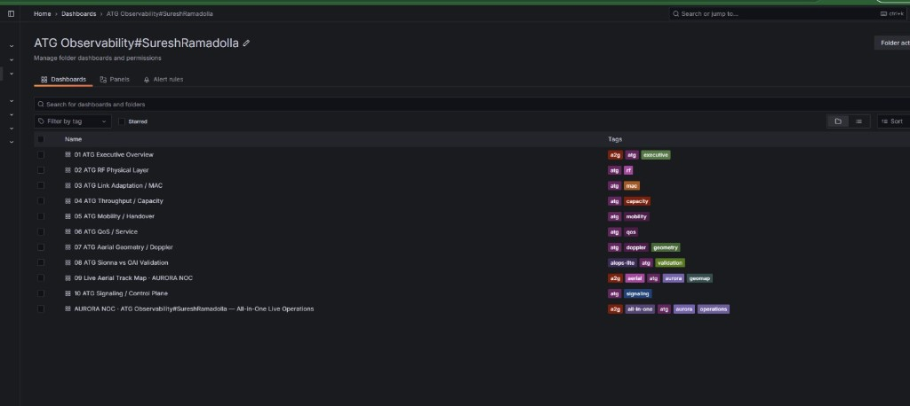
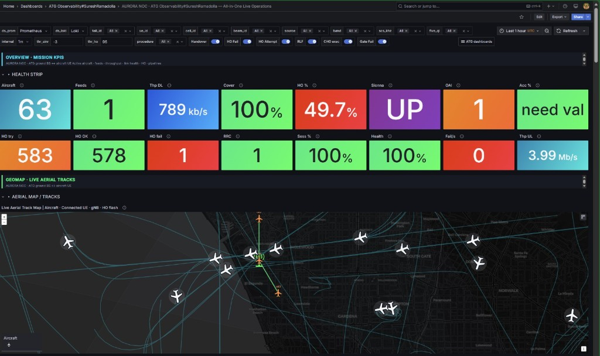
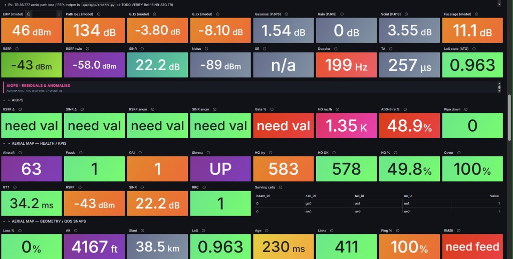
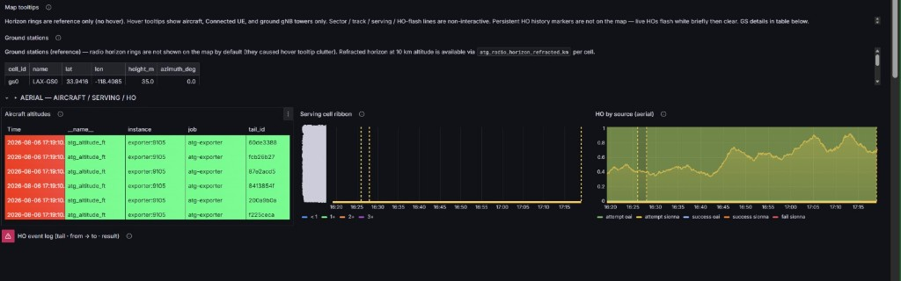
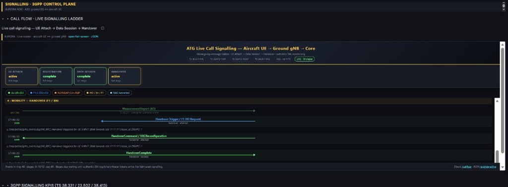
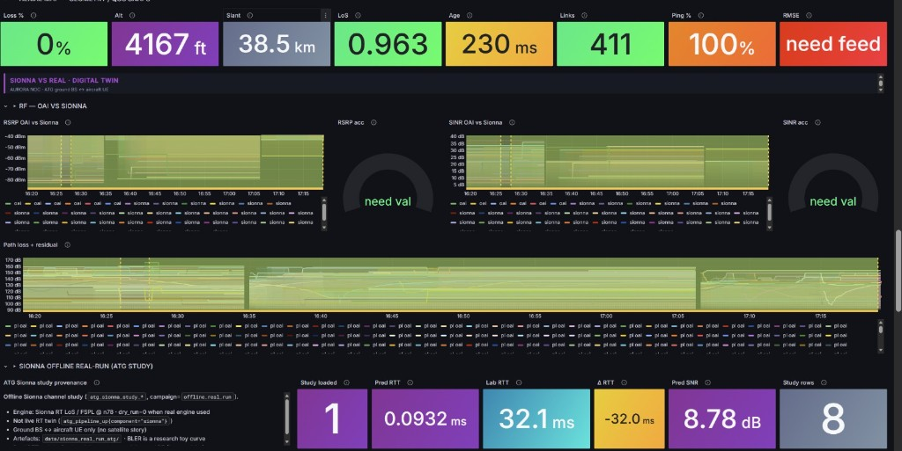
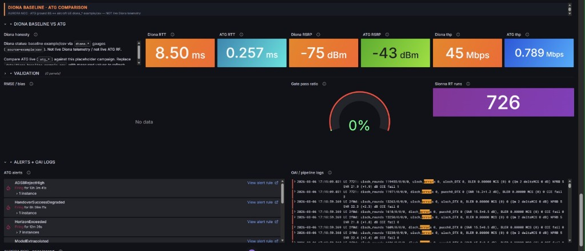

# LTE / 5G Air-to-Ground (ATG) Emulation Lab

### Ground base station ↔ aircraft UE — OpenAirInterface RFsim (band n78, AWGN)


---

## Table of Contents

1. [Overview](#overview)
2. [Live Demo](#live-demo)
3. [Project Structure](#project-structure)
4. [Key Findings](#key-findings)
5. [Project Report](#project-report)
6. [Dashboard Pages](#dashboard-pages)
7. [Tech Stack](#tech-stack)
8. [Installation & Local Setup](#installation--local-setup)
9. [Dataset](#dataset)
10. [Optional physics twin (Sionna)](#optional-physics-twin-sionna)
11. [Deployment (Streamlit Community Cloud)](#deployment-streamlit-community-cloud)
12. [.gitignore Recommendations](#gitignore-recommendations)
13. [License](#license)
14. [Author](#author)

---

## Overview

This folder is the **GitHub-ready public pack** for a **5G NR air-to-ground (ATG / A2G)** emulation lab: a **ground gNB** serving an **aircraft UE** on OpenAirInterface **RFsimulator**. Topology follows **3GPP TR 38.876** (ground BS ↔ airborne UE). It is **software emulation**, not over-the-air RF, not an SDR flight campaign, and not Rel-18 NR-ATG RF conformance.

**Who it's for:**
- **RAN / RF engineers** — n78 Path-A2G bring-up, AWGN RFsim, aircraft altitude in the UE conf, F1 signalling vs modeled A3.
- **Observability engineers** — Grafana Lab Demo / Live Aerial Track Map / Super Ops with **measured vs model** labels.
- **Reviewers** — verified PDU ping (~6–14 ms) and an explicit honesty contract.

**Key capabilities:**
| Capability | Details |
|---|---|
| ✈️ **Path A2G attach** | Band **n78**, AWGN, **UE = RFsim server**, DU = client |
| 📡 **Measured U-plane** | Ping **20/20** via `oaitun_ue1` → DN **192.168.70.135**, typically **~6–14 ms** RTT |
| 🗺️ **Kinematics (optional)** | Live or replay ADS-B into the observability plane; pseudonymised `tail_id` only |
| 📊 **Grafana** | Lab Demo / Live Aerial Track Map / Super Ops (plus eleven JSON boards in this pack) |

This pack is **ATG only**: ground base station ↔ aircraft UE.

---

## Live Demo

There is **no hosted public cloud app**. Demo surfaces run locally:

| Surface | What you open |
|---|---|
| **Lab Demo** | Grafana `atg-full-lab` or executive / all-in-one boards |
| **Live Aerial Track Map** | Grafana `atg-orbit` / `atg-live-topology` (ADS-B / aircraft–GS geometry) |
| **Super Ops** | Grafana `atg-lab-super-ops` / `atg-all-in-one` |

Typical URLs:

- Observability on Windows Docker: `http://localhost:3000`
- Ubuntu ATG VM (example): `http://192.168.122.133:3000/d/atg-full-lab`

> **Demo success = Ping UP** through `oaitun_ue1` to `192.168.70.135` at **~6–14 ms**. Near-0 ms is usually host/loopback, not the PDU path. Empty Grafana series stay empty on purpose.

End-to-end flow: [`FLOW.md`](FLOW.md). Day-of notes: [`docs/SETUP.md`](docs/SETUP.md). Honesty contract: [`HONESTY.md`](HONESTY.md). JSON for eleven boards: [`dashboards/`](dashboards/).

Screenshots below appear **once**. Each view has a short explanation and the finding for that board. JSON filenames and UIDs are listed under [Dashboard Pages](#dashboard-pages) without repeating the images.

### Grafana folder catalog (11 dashboards)



The Grafana folder **ATG Observability** is the public pack’s 01–11 catalog. Boards 01–07 are layer slices (executive, RF, MAC, capacity, mobility, QoS, aerial geometry). **08** is Sionna vs OAI validation (optional physics twin). **09** is the Live Aerial Track Map (ADS-B / lab geometry; JSON filename token `orbit` is a path name only). **10** is signalling / control plane. **11** is All-in-One Live Operations. Tags (`atg`, `a2g`, `geomap`, `signaling`, …) are Grafana search labels, not extra radio modes.

- **Finding:** eleven provisioned ATG boards; this lab is ground gNB ↔ aircraft UE on n78 AWGN.

### All-in-One Live Operations (map + health strip)



Single-pane ops: mission KPIs on the health strip plus the geomap of aircraft tracks and serving links. **Aircraft / Feeds** count ADS-B (or replay) kinematics with pseudonymised `tail_id` only — they are **not** attached OAI UEs unless a lab UE is on the stack. **OAI = 1** and **Ping / session health** are the RAN/core liveness row; treat **Thp DL/UL** as measured only when the PDU path is up (`ping_up=1` and throughput above the lab floor), otherwise it is capacity or probe residue, not cabin user traffic. **Sionna UP** means the optional twin exporter is reachable, not that every RF tile is ray-traced. **HO try / OK / fail** mixes authentic **F1 HO** counters from OAI CU logs (`source=oai`) with **modeled A3** events on tracks (`procedure=modeled_a3`, Off 3 dB / Hys 1 dB / TTT 320 ms). The map is aircraft ↔ ground station geometry.

- **Finding:** ping/session is the measured U-plane row; extra aircraft icons are tracks, not extra PDU sessions; HO on the strip is not a TS 38.331 A3 success KPI.

### Link budget / KPIs / AIOps tiles



Stat tiles for modeled link budget (EIRP, path loss, antenna / fuselage terms, ITU-R gaseous / rain / scintillation helpers), **log/simulator** RF (RSRP, SINR when parsed from OAI), geometry (altitude, slant range, LoS index, Doppler, timing advance), and AIOps-lite residuals. Orange/blue path-loss family values are **model** (FSPL / TR-style helpers on the panel), not over-the-air campaign measurements. Green RSRP/SINR are OAI RFsim / log when a feed exists; **twin RSRP** is Sionna (or FSPL stand-in) and must not be quoted as the same series. Tiles marked **need val** / **need feed** (RMSE, residual Δ) are empty **on purpose** until a paired OAI+twin sample is published — they are not hidden failures. HO and ADS-B reject rates on this strip are exporter statistics; they are not Rel-18 NR-ATG RF conformance.

- **Finding:** quote **model** vs **log** vs **measured ping** separately; residual/RMSE empties are honest, not omitted evidence.

### Serving cell ribbon, HO log, and ground stations



Ground-station table (`gs0` / lab site coordinates and antenna height) is **configuration**, used as the geometry origin for slant range and map pins. Aircraft altitude rows are exporter kinematics (`atg_altitude_ft` by `tail_id`). The **serving-cell ribbon** shows which lab cell/PCI is associated over time; dashed markers are event ticks, not proof of measurement-report A3. **HO by source** splits **OAI** (F1 signalling-class HO from CU logs / dual-DU CI) from **Sionna / model** (A3-like thresholding on ADS-B + link budget). Do not collapse those two into one “handover success rate.” The HO event log is `tail : from → to : result` from the exporter; empty or partial logs mean no labelled events in the scrape window.

- **Finding:** dual-DU **F1 HO** is signalling-class; **modeled A3** on ADS-B is labelled `procedure=modeled_a3`.

### Signalling / 3GPP control plane



Control-plane ladder for the aircraft UE: attach / registration / PDU session / handover phases parsed from OAI logs (RRC TS 38.331, F1AP TS 38.473, NGAP TS 38.413, NAS TS 24.501). Colour keys are **interfaces** (Uu, F1-C, N2, NAS), not RF quality. A **MeasurementReport (A3)** arrow on a demo ladder is a **log-token / procedure label** when present; this pack’s green dual-DU mobility evidence is **F1 HO** (CU telnet / CI), **not** OAI measGap A3. Registration and data-session “complete” reflect message counts seen in the log scrape, not an operator OSS KPI. Use this board to confirm 3GPP procedure shape on RFsim, not to claim OTA signalling traces.

- **Finding:** F1 HO on the ladder is the demonstrated mobility path for this pack.

### Sionna vs OAI digital twin



Overlay of **measured/log OAI** RSRP, SINR, and path loss against the **optional Sionna RT** twin (`source=sionna` when CIR amplitudes are finite; otherwise those series stay absent). Header tiles (loss, altitude, slant, LoS, ping) are mixed: ping success is **measured** on `oaitun` when the probe is wired; LoS / slant are **geometry**. Accuracy gauges and RMSE showing **need val / need feed** mean no paired residual has been computed for that window — do not invent an RMSE. The bottom “Sionna offline real-run” strip is an **offline ATG study** (LoS / FSPL @ n78), not a live ray-tracer attached to every TTI. Predicted RTT from that study is a physics toy; **lab RTT** is the stack probe (healthy ATG PDU is typically ~6–14 ms, not the study’s sub-ms prediction).

- **Finding:** twin traces publish only with finite CIR (`ATG_SIONNA=1`); offline study RTT is not the PDU ping.

### Diona baseline comparison



Side-by-side **Diona CSV baseline** vs live `atg_*` / OAI tiles. Diona RTT, RSRP, and throughput are **static example rows from a file**, not a live terrestrial scrape and not a second RAN. Use them only as a numeric foil (order-of-magnitude comparison). Live ATG RTT on this board must still be judged on the **PDU path** (`oaitun_ue1` → `192.168.70.135`); near-0 ms is usually host/loopback. RMSE / gate-pass empty or 0% means the validation gate is **not claimed**. Alert list (ADS-B reject, HO degraded, horizon, model extrapolated) is exporter/Alertmanager state for the kinematics/model path. OAI pipeline log lines (SNR, BLER, MCS, ulsch rounds) are **softmodem text**, i.e. simulator/log RF.

- **Finding:** Diona columns are CSV examples; gate-pass / RMSE empty means validation is not claimed.

---

## Project Structure

```
github-atg-lab/                 # This public pack (git root)
├── README.md
├── HONESTY.md
├── LICENSE                     # MIT
├── PUSH_TO_GITHUB.md
├── FLOW.md
├── ARCHITECTURE.md
├── dashboards/                 # Grafana JSON (01–11)
├── map-assets/
├── oai-config/path-a2g/        # Radio confs + README (bring-up scripts are private)
├── docs/
│   ├── SETUP.md
│   ├── A2G_DASHBOARD_HONESTY.md
│   ├── MEDIUM_ATG_OBSERVABILITY.md
│   ├── reports/
│   ├── logs-samples/           # Redacted excerpts
│   └── screenshots/
└── .gitignore
```

OAI source and CN5G images live on the Ubuntu VM. Exporter, Docker Compose, and bring-up **scripts** stay in the sibling **private** folder:

`C:\Users\sures\OneDrive\Desktop\LTE_5g_ATG_emulation_lab\github-atg-lab-private`

Do not commit 3GPP PDFs.

---

## Key Findings

> Figures in [Live Demo](#live-demo) are **this lab’s RFsim evidence**, not OTA flight-test results. Screenshots are not repeated here.

| Metric | Value / statement |
|---|---|
| **Path A2G ping** | **20/20**, **~6–14 ms** ICMP via `oaitun` → **192.168.70.135** |
| **Channel** | **AWGN** |
| **Band** | **n78** (~3.5 GHz stand-in; TR 38.876 Table 5-1) |
| **UE altitude** | Cruise **~10 km AGL** in `nrue.a2g.rfsim.conf` |
| **RFsim roles (green Path A2G)** | **UE = server**, DU = client |
| **F1 HO (dual-DU)** | Signalling-class demo from CU logs (`source=oai`) — **not** measurement-report A3 |
| **Modeled A3** | Off **3 dB** / Hys **1 dB** / TTT **320 ms** on ADS-B tracks — labelled `procedure=modeled_a3` |
| **Scope** | Software emulation — **not OTA** |

---

## 📄 Project Report

| Doc | Topic |
|---|---|
| [`HONESTY.md`](HONESTY.md) | Scope, ping, Grafana provenance |
| [`FLOW.md`](FLOW.md) | Two-host data path |
| [`ARCHITECTURE.md`](ARCHITECTURE.md) | Boxes, arrows, metric labels |
| [`docs/MEDIUM_ATG_OBSERVABILITY.md`](docs/MEDIUM_ATG_OBSERVABILITY.md) | Long-form write-up |
| [`docs/A2G_DASHBOARD_HONESTY.md`](docs/A2G_DASHBOARD_HONESTY.md) | What each panel may claim |
| [`docs/reports/`](docs/reports/) | HO / QoS / multicell live notes |
| [`oai-config/path-a2g/README.md`](oai-config/path-a2g/README.md) | Path-A2G recipe |

### Radio vs mobility comparison

| Recipe | Result | How to say it |
|---|---|---|
| Path A2G single-DU AWGN | Attach + ping **PASS** | Headline U-plane |
| Dual-DU F1 HO (CU telnet) | Signalling-class | **Not** A3 measurement HO |
| Modeled A3 on ADS-B | Map / exporter | Geometry + link budget / optional Sionna — **not** OAI measGap A3 |

---

## Dashboard Pages

JSON for all eleven boards lives in [`dashboards/`](dashboards/). Panel-level claims: [`docs/A2G_DASHBOARD_HONESTY.md`](docs/A2G_DASHBOARD_HONESTY.md). **Walkthrough screenshots are only in [Live Demo](#live-demo)** (catalog → all-in-one → link budget → serving/HO → signalling → Sionna twin → Diona baseline).

| # | Board | JSON | What it is allowed to show |
|---|---|---|---|
| 01 | ATG Executive Overview | `01_atg_executive_overview.json` | Ping UP, pipeline, serving/UE summary |
| 02 | ATG RF Physical Layer | `02_rf_physical_layer.json` | RFsim / log RF — not OTA |
| 03 | ATG Link Adaptation / MAC | `03_link_adaptation_mac.json` | MCS / HARQ from logs |
| 04 | ATG Throughput / Capacity | `04_throughput_capacity.json` | Measured thr only if PDU up; else capacity estimate |
| 05 | ATG Mobility / Handover | `05_mobility_handover.json` | F1 HO (`source=oai`) vs modeled A3 |
| 06 | ATG QoS / Service | `06_qos_service.json` | Probe / 5QI when wired |
| 07 | ATG Aerial Geometry / Doppler | `07_aerial_geometry_doppler.json` | ADS-B geometry, Doppler model |
| 08 | ATG Sionna vs OAI Validation | `08_sionna_vs_oai_validation.json` | Twin vs log; empty if Sionna off |
| 09 | Live Aerial Track Map | `09_live_orbit_map.json` | Aircraft / GS map (ADS-B geometry) |
| 10 | ATG Signaling / Control Plane | `10_signaling_control_plane.json` | OAI log ladder (RRC / F1AP / NGAP) |
| 11 | All-in-One Live Operations | `11_all_in_one_live_operations.json` | Health strip + geomap |

---

## Tech Stack

| Technology | Purpose | Notes |
|---|---|---|
| **OpenAirInterface** | gNB CU/DU + nrUE | RFsim (`-w SIMU`); Path A2G n78 |
| **RFsimulator** | IQ over TCP | AWGN; UE as server on green Path A2G |
| **OAI CN5G** | 5G SA core | DN **192.168.70.135** |
| **3GPP TR 38.876** | ATG topology | Ground BS ↔ aircraft UE |
| **Prometheus / Grafana** | Lab Demo / map / Super Ops | Prefer `atg_*` series in new work |
| **ADS-B (optional)** | Kinematics | Live or replay; `tail_id` only |
| **Sionna RT (optional)** | Physics twin | Off unless explicitly enabled |

---

## Installation & Local Setup

### Prerequisites

- Ubuntu VM with OAI built for RFsim and OAI CN5G
- This pack’s `oai-config/path-a2g/` copied to `~/oai-config/path-a2g/` on the VM
- Optional: Windows Docker observability (private scripts repo)

This pack does **not** vendor the OAI tree. Bring-up **scripts are not in this public repo**.

### Steps

```bash
# 1. Clone the public pack (docs, dashboards, reports)
git clone https://github.com/sureshramadolla428/LTE-5G-Air-to-Ground-ATG-Emulation-Lab.git
cd LTE-5G-Air-to-Ground-ATG-Emulation-Lab
less HONESTY.md
less FLOW.md
```

To run OAI + Docker observability, use the **private** scripts repo (`github-atg-lab-private`). High-level notes: [`docs/SETUP.md`](docs/SETUP.md).

---

## Dataset

There is no customer CSV. Lab inputs:

| Property | Detail |
|---|---|
| **Path A2G confs** | CU / DU0 / DU1 / aircraft nrUE (n78, ~10 km AGL) |
| **ADS-B** | Optional live (adsb.fi / OpenSky) or Parquet replay — **not** bundled |
| **Privacy** | Pseudonymised `tail_id` only — no raw ICAO24 / callsign in public metrics |
| **Log samples** | Redacted excerpts under [`docs/logs-samples/`](docs/logs-samples/) |

> Do not commit `.env`, OpenSky credentials, full live logs, or 3GPP PDFs.

---

## Optional physics twin (Sionna)

The optional physics twin is **Sionna RT** (LLVM/CPU). It is **off** unless `ATG_SIONNA=1`. Gauges with `source=sionna` publish only when CIR amplitudes are finite; otherwise those series stay absent. That is not a live Diona terrestrial scrape.

---

## Deployment (Streamlit Community Cloud)

This project is **not** a Streamlit app and is **not** deployed on Streamlit Community Cloud.

**What “deploy” means here:**

1. Push **this** pack to a **public** GitHub repo (see [`PUSH_TO_GITHUB.md`](PUSH_TO_GITHUB.md)).
2. Keep exporter / Compose / full bring-up scripts in a **private** repo if you use `github-atg-lab-private`.
3. Run OAI + RFsim on Ubuntu; present Grafana locally.

> Software emulation, not OTA. Do not describe the GitHub repo as a live ATG network.

---

## .gitignore Recommendations

This pack already includes a `.gitignore`. Keep out of git:

```gitignore
.env
*.pcap
*.pdf
*.parquet
*.log
!docs/logs-samples/*.log
.venv/
__pycache__/
```

Do not commit 3GPP specification PDFs or VM log dumps.

---

## License / Rights

All Rights Reserved. This public repository is a showcase; see LICENSE. No permission is granted to use, copy, modify, or distribute any part of this repository without prior written consent.

## Author

Created by **Suresh Ramadolla**.

---

*Personal research and education project on OpenAirInterface. Software emulation of 5G ATG (ground BS ↔ aircraft UE) — not an over-the-air system, and not affiliated with or endorsed by any operator or vendor.*


